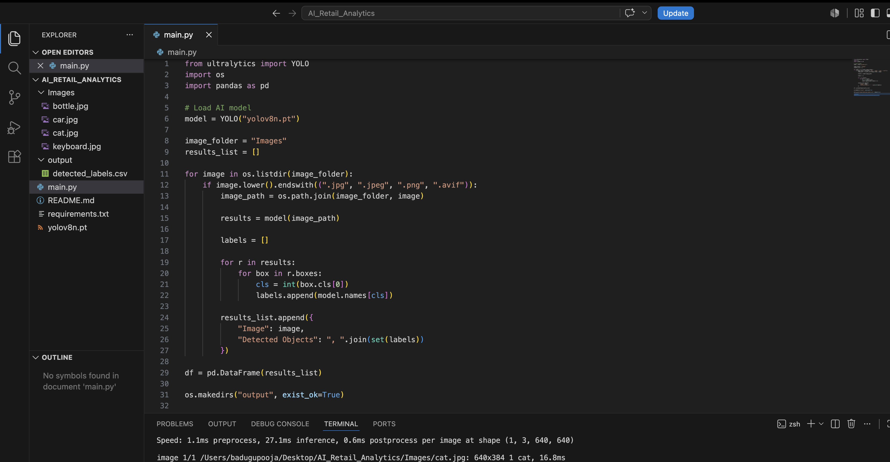

# AI-Retail-Analytics

AI-powered retail image analysis using YOLO and Google Cloud Platform (GCP) BigQuery.

## Project Overview

This project analyzes retail images using YOLO (You Only Look Once) for object detection and Google Cloud BigQuery for storing and retrieving the detected object data.

## Technologies Used

Python  
YOLO  
Pandas  
Google Cloud Platform (GCP)  
Google BigQuery  
CSV

## How It Works

1. Retail images are provided as input.
2. YOLO detects objects present in the images.
3. The detected object information is collected using Python.
4. The data is stored in CSV format.
5. The data is uploaded to Google Cloud BigQuery.
6. BigQuery is used to store, query, and retrieve the detected object data.

## Example

Input images can contain objects such as:

keyboard  
bottle  
cat  
car

The detected objects are stored as structured data and can be retrieved using SQL queries in BigQuery.

## Project Objective

The main objective is to demonstrate how AI-based image object detection can be combined with Google Cloud services to analyze and manage retail image data efficiently.
## Project Results

The YOLO model successfully detected objects from the input images.

